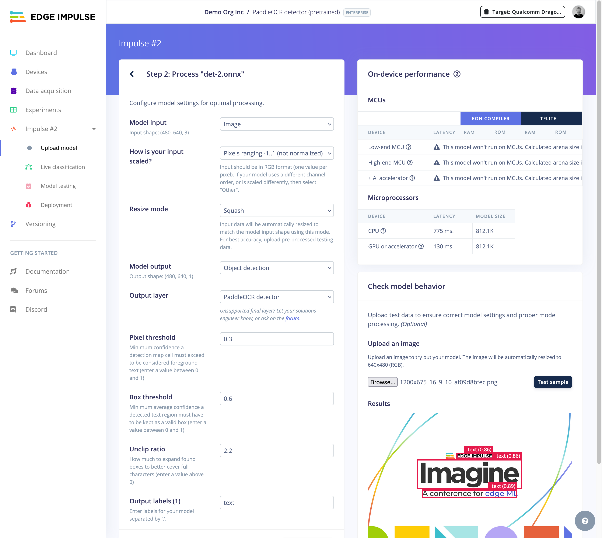

# Running the Edge Impulse Two-stage OCR for Linux with Arduino UNO Q and Arduino App Lab

This repository contains instructions to get 2 stages of OCR detector from edge impulse for your target platform, as well as a python script that runs both models and displays the result on the screen.

Inference of the models is performed using [Edge Impulse Linux Python SDK](https://github.com/edgeimpulse/linux-sdk-python/tree/master) - so looking at this example you can include the OCR logic (or any edge impulse model inference) in your python application.


This OCR repository requires two models in [EIM format](https://docs.edgeimpulse.com/hardware/deployments/run-linux-eim):

1. A text detector model (object detection, single class). This will find areas of text. For this application, the easiest is to use a generic PaddleOCR detector; but you can swap it out for a custom one (e.g. a YOLO-Pro based license plate detector). Either import a bounding box model into Edge Impulse through Bring-Your-Own-Model or train one from scratch.
2. A text recognizer model - which interprets the bounding boxes found by model 1. The only model type supported in this application are PaddleOCR recognizers. Import them into your Edge Impulse through Bring-Your-Own-Model; and set output type "Freeform" (the parsing of the output tensor is done in this application app).

This repository grabs data from your camera, and stitches these models together to run a complete OCR application (incl. nice demo view).

## Uploading your models

> **Note:** Prebuilt models for Apple-silicon macOS, aarch64 Linux boards and aarch64 Linux boards w/ Qualcomm QNN optimizations (e.g. Rubik Pi, RB3 Gen 2 Vision Kit) are in `models/`.

### Text detector (pretrained PaddleOCR model)

> You can replace this stage with any other object detection model - as long as it has a single class (or change [classify-camera-webserver.ts](ts/classify-camera-webserver.ts) to ignore other classes).

1. Download [PaddleOCR detector model](https://huggingface.co/monkt/paddleocr-onnx/resolve/436f75fa5a51ecc6b1d27892684d9c49ac8600c0/detection/v3/det.onnx) in ONNX format ([HF: monkt/paddleocr-onnx](https://huggingface.co/monkt/paddleocr-onnx)).
2. Create a new [Edge Impulse project](https://studio.edgeimpulse.com), e.g. name it "PaddleOCR detector (pretrained)".
3. Click **Dashboard > Upload your model**.
4. On the 'Step 1: Upload pretrained model' screen:
    1. Under "Upload your trained model" select `det.onnx`.
    2. Under "Set input shape for ONNX file" set `1, 3, 480, 640` (you can change this if you want higher/lower resolution).
    3. *Optional (to quantize the model)*: Under "Upload representative features" select `source_models/repr_dataset_480_640.npy` (from this repo).

        > If you want to use another resolution, you'll need to create a new representative dataset. Run from this repository:

        ```bash
        # 1) create a new venv, and install dependencies in source_models/requirements.txt
        # e.g. on macOS/Linux via 'cd source_models && python3 -m venv .venv && source .venv/bin/activate && pip3 install -r requirements.txt && cd ..'

        # 2) download an OpenImages subset
        oi_download_images --base_dir=source_models/openimages --labels Car --limit 200

        # 2) create a representative dataset from OpenImages 'car' class, scaled -1..1
        python3 source_models/create_representative_dataset.py --height 480 --width 640 --limit 30
        ```

    4. Click "Upload file".
5. On the 'Step 2: Process "det.onnx"' screen:
    1. Under "Model input" select 'Image'.
    2. Under "How is your input scaled?" select 'Pixels range -1..1 (not normalized)'.
    3. Under "Model output" select 'Object detection'.
    4. Under "Output layer" select 'PaddleOCR detector'.
    5. You can now upload an image under 'Check model behavior', and optionally tune the thresholds to perfectly match your text (the defaults should be pretty good).

        

    6. Click **Save model**.

### Text recognizer (pretained PaddleOCR recognizer)

1. Download a [PaddleOCR recognizer model (English)](https://huggingface.co/monkt/paddleocr-onnx/resolve/436f75fa5a51ecc6b1d27892684d9c49ac8600c0/languages/english/rec.onnx) in ONNX format (other languages available on [HF: monkt/paddleocr-onnx](https://huggingface.co/monkt/paddleocr-onnx)).

    > If you want to switch languages, also download the `dict.txt` file for that language (e.g. [languages/korean](https://huggingface.co/monkt/paddleocr-onnx/tree/main/languages/korean)) and place it in the `source_models` folder of this repository.

2. Create a new [Edge Impulse project](https://studio.edgeimpulse.com), e.g. name it "PaddleOCR recognizer (pretrained)".
3. Click **Dashboard > Upload your model**.
4. On the 'Upload pretrained model' screen:
    1. Under "Upload your trained model" select `rec.onnx`.
    2. Under "Set input shape for ONNX file" set `1, 3, 48, 320` (you can change this if you want higher/lower resolution).
    3. *Optional (to quantize the model)*: Under "Upload representative features" select `source_models/repr_dataset_32_320.npy` (from this repo).

        > If you want to use another resolution, you'll need to create a new representative dataset. Run from this repository:

        ```bash
        # 1) create a new venv, and install dependencies in source_models/requirements.txt
        # e.g. on macOS/Linux via 'cd source_models && python3 -m venv .venv && source .venv/bin/activate && pip3 install -r requirements.txt && cd ..'

        # 2) download an OpenImages subset
        oi_download_images --base_dir=source_models/openimages --labels Car --limit 200

        # 2) create a representative dataset from OpenImages 'car' class, scaled -1..1
        python3 source_models/create_representative_dataset.py --height 48 --width 320 --limit 60
        ```

    4. Click "Upload file".
5. On the 'Step 2: Process "rec.onnx"' screen:
    1. Under "Model input" select 'Image'.
    2. Under "How is your input scaled?" select 'Pixels range -1..1 (not normalized)'.
    3. Under "Resize mode" select 'Squash'.
    4. Under "Model output" select 'Freeform'.
    5. Click **Save model**.

## Downloading your models in EIM format

From the device where you want to run your model (so the right hardware optimizations are loaded):

1. Install the [Edge Impulse Linux CLI](https://docs.edgeimpulse.com/tools/clis/edge-impulse-linux-cli).
2. Download the detector model:

    ```bash
    # Download f32 model
    # When prompted, log in, and select "PaddleOCR detector (pretrained)"
    edge-impulse-linux-runner --download ./detect-v3-640-480-f32.eim --force-variant float32 --clean

    # Download i8 model as well (if you've quantized before)
    edge-impulse-linux-runner --download ./detect-v3-640-480-i8.eim --force-variant int8
    ```

3. Download the recognizer model:

    ```bash
    # Download f32 model
    # When prompted, log in, and select "PaddleOCR recognizer (pretrained)"
    edge-impulse-linux-runner --download ./recognizer-320-48-f32.eim --force-variant float32 --clean

    # Download i8 model as well (if you've quantized before)
    edge-impulse-linux-runner --download ./recognizer-320-48-i8.eim --force-variant int8
    ```


## Running on Arduino UNO Q (Arduino App Lab)

This project is compatible with Arduino App Lab as a standalone Flask application. It includes auto-detection of models based on platform, a web UI accessible from any browser, and camera detection that filters out the Qualcomm Venus encoder/decoder devices.

### Quick Start on Arduino UNO Q

1. Copy the project to your Arduino UNO Q:

    ```bash
    scp -r . arduino@<device-ip>:/home/arduino/ArduinoApps/ocr-demo
    ```

2. SSH into the board and set up the environment:

    ```bash
    ssh arduino@<device-ip>
    cd /home/arduino/ArduinoApps/ocr-demo

    # Make model files executable (required for .eim files)
    chmod +x models/arduino-uno-q/*.eim
    chmod +x models/linux-aarch64/*.eim

    # Create virtual environment and install dependencies
    python3 -m venv .venv
    source .venv/bin/activate
    pip install --no-cache-dir -r requirements.txt
    ```

3. Run the application (models are auto-detected):

    ```bash
    # Option A: Run directly (auto-detects models for the platform)
    python3 web_inference.py

    # Option B: Via App Lab entry point (applies dependency mocks)
    python3 python/main.py

    # Option C: Via App Lab CLI
    arduino-app-cli app start .
    ```

4. Open `http://<device-ip>:5001` in your browser.

    The app auto-starts inference on the default RTSP stream (`rtsp://10.0.0.124:554/mjpeg/1`).
    You can change the RTSP URL or switch to a wired camera from the UI at any time.

### Project Structure (App Lab compatible)

```
ocr-demo/
├── app.yaml                  # App Lab app configuration (port 5001)
├── web_inference.py          # Main OCR inference + Flask web server
├── requirements.txt          # Python dependencies (opencv-python-headless)
├── python/
│   ├── main.py               # App Lab entry point (applies mocks, delegates)
│   ├── requirements.txt      # Same deps (App Lab convention)
│   └── utils/
│       └── mock_dependencies.py  # Mocks for pyaudio/six on UNO Q
├── models/
│   ├── arduino-uno-q/        # UNO Q models (linux-aarch64, auto-detected first)
│   ├── linux-aarch64/        # Generic aarch64 models (auto-detected second)
│   ├── mac-arm64/            # macOS ARM64 models (auto-detected on Mac)
│   └── qnn-aarch64/          # Qualcomm QNN optimized models
├── source_models/
│   └── rec_en_dict.txt       # Character dictionary for OCR
├── python-inference.py       # Original CLI inference (OpenCV display)
└── images/                   # Documentation images
```

### Model Auto-Detection

When launched without explicit `--detect-file` / `--predict-file` arguments, the app automatically:

1. Detects the platform (`linux-aarch64` on UNO Q, `mac-arm64` on Mac)
2. Searches model directories in priority order:
   - `models/arduino-uno-q/` (UNO Q specific, checked first on aarch64)
   - `models/linux-aarch64/` (generic aarch64, checked second)
   - `models/mac-arm64/` (checked on macOS)
3. Finds the dictionary file in `source_models/rec_en_dict.txt`

### Video Sources (RTSP / wired camera)

The app supports two kinds of video sources:

- **RTSP/HTTP network streams** (default): inference auto-starts on `rtsp://10.0.0.124:554/mjpeg/1`.
  Override the default with `--rtsp-url`, e.g.:

    ```bash
    python3 web_inference.py --rtsp-url rtsp://10.0.0.124:554/mjpeg/1
    ```

- **Wired cameras**: select a device from the dropdown in the web UI (e.g. `/dev/video2` for a Logitech BRIO RGB stream). The Venus encoder/decoder devices are filtered out automatically.

The RTSP URL field in the UI takes priority over the camera dropdown when filled. If an RTSP connection drops, the app attempts to reconnect automatically.

### Storage Tips

The UNO Q has limited storage (~3.6 GB on `/home/arduino`). Tips:

- Use `opencv-python-headless` instead of `opencv-python` (already configured)
- Use `pip install --no-cache-dir` to avoid filling pip cache
- Run `arduino-app-cli system cleanup` to free Docker space
- If `/home` is full, create your venv on the root partition: `sudo mkdir -p /opt/ocr-venv && sudo chown arduino:arduino /opt/ocr-venv && python3 -m venv /opt/ocr-venv`

---

## Running the OCR application (Python CLI)

This repository also includes a Python CLI implementation that runs inference on the camera stream and displays the result on the screen using OpenCV.

1. Install Python dependencies (recommended: create a venv):

    ```bash
    python3 -m venv .venv
    source .venv/bin/activate
    pip3 install -r requirements.txt
    ```

2. Run the Python app:

    ```bash
    python3 python-inference.py --detect-file ./models/mac-arm64/detect-v3-640-480-i8.eim --predict-file ./models/mac-arm64/recognizer-320-48-f32.eim --dict-file ./source_models/rec_en_dict.txt
    ```

    Notes:
    - Use `--display` if you want to display the camera feed with the results overlay

    If you have multiple cameras you can select the OpenCV device index:

    ```bash
    python3 python-inference.py --camera 1 --detect-file ... --predict-file ... --dict-file ... --display
    ```

    Or use an RTSP/HTTP network stream instead of a wired camera:

    ```bash
    python3 python-inference.py --rtsp-url rtsp://10.0.0.124:554/mjpeg/1 --detect-file ... --predict-file ... --dict-file ...
    ```

## Running the Web UI (any platform)

The web interface supports both Arduino UNO Q and macOS/Linux. Models are auto-detected:

```bash
# Auto-detect models (recommended)
python3 web_inference.py

# Or with explicit model paths
python3 web_inference.py \
    --detect-file ./models/mac-arm64/detect-v3-640-480-f32.eim \
    --predict-file ./models/mac-arm64/recognizer-320-48-f32.eim \
    --dict-file source_models/rec_en_dict.txt
```

Access at `http://localhost:5001`

## Developing locally, running remote

You can develop and build locally, then sync to another machine via `sync.sh`. E.g.:

```bash
bash sync.sh ubuntu@rubikpi
```

Then ssh into your remote machine and just run the already built script:

```
cd ocr-demo-linux
python3 web_inference.py
```
